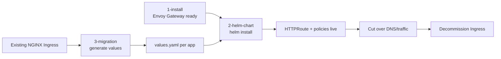

# NGINX Ingress → Envoy Gateway API migration kit

A self-contained, **vendor-neutral** toolkit to move applications from NGINX
Ingress to the Kubernetes **Gateway API** running on **Envoy Gateway**. Nothing
here is tied to any specific company or cloud — set your `kubectl` context and go.

```
PP/
├── 1-install/        Install & upgrade Envoy Gateway (control plane + platform gateway)
├── 2-helm-chart/     Generic Helm chart to deploy HTTPRoutes + policies per app
└── 3-migration/      Python tool: Ingress -> Helm values + reference manifests
```

## The three parts

### 1. Install Envoy Gateway — [`1-install/`](1-install/README.md)
Shell scripts that install (and upgrade) everything the platform needs, in the
correct order:

1. Gateway API CRDs
2. Envoy Gateway control plane (Helm)
3. `EnvoyProxy` data-plane config
4. `GatewayClass`
5. Shared `Gateway` + HTTP→HTTPS redirect

```bash
cd 1-install
./install-envoy-gateway.sh --dry-run   # preview
./install-envoy-gateway.sh             # install
```

### 2. Deploy routes — [`2-helm-chart/`](2-helm-chart/README.md)
A small Helm chart (`gateway-routes`) that renders an `HTTPRoute` plus optional
`BackendTrafficPolicy`, `BackendTLSPolicy`, `ClientTrafficPolicy`, and
`EnvoyPatchPolicy`. Supports the shared wildcard gateway and per-app custom
domains. Includes ready-to-copy example values files.

```bash
cd 2-helm-chart
helm install myapp gateway-routes \
  -f gateway-routes/examples/01-shared-gateway-basic.yaml \
  -n myapp --create-namespace
```

### 3. Migrate existing Ingresses — [`3-migration/`](3-migration/README.md)
A read-only Python tool that inspects the Ingress objects in a cluster and
generates a `values.yaml` (for the chart in part 2) plus reference manifests for
every app.

```bash
cd 3-migration
pip install -r requirements.txt
python migrate_ingress_to_gateway.py --shared-domain-suffix .example.com --output ./generated
```

## End-to-end flow



1. **Install** Envoy Gateway once per cluster (part 1).
2. **Generate** per-app values from existing Ingresses (part 3).
3. **Review** the generated values and any `MANUAL-REVIEW.txt`.
4. **Deploy** each app with the Helm chart (part 2).
5. **Validate** route status, cut over traffic, retire the Ingress.

## Requirements

| Tool | Used by | Notes |
|------|---------|-------|
| `kubectl` | all | Point it at the target cluster first |
| `helm` v3.8+ | parts 1, 2 | OCI chart support required |
| Python 3.8+ + PyYAML | part 3 | `pip install -r 3-migration/requirements.txt` |

## Design principles

- **Generic & portable** — no organization-, domain-, or cloud-specific values
  are hardcoded. Placeholders (`*.example.com`, `shared-tls-secret`) are clearly
  marked for you to replace.
- **Gateway API native** — prefers standard Gateway API and Envoy Gateway
  constructs over legacy annotation translation.
- **Safe defaults** — Envoy's default body streaming is kept (no `proxy-body-size`
  porting); a 60s gateway-wide request timeout matches NGINX's default.
- **Read-only migration** — the Python tool never mutates the cluster; it only
  reads Ingresses and writes files you review before applying.

## Reference documentation

- Envoy Gateway: <https://gateway.envoyproxy.io/docs/>
- Gateway API: <https://gateway-api.sigs.k8s.io/>
- Envoy Gateway API types: <https://gateway.envoyproxy.io/docs/api/extension_types/>
